# Database (PostgreSQL)

Schema source of truth: Flyway migrations in `backend/src/main/resources/db/migration` (`V1`–`V7`); development seed
data in `db/devdata/V9000__dev_seed.sql` (dev profile only). Hibernate only validates (`ddl-auto: validate`).

Conventions (§47, §89): snake_case plural tables, UUID primary keys, `NUMERIC(14,2)` money, `NUMERIC(14,3)`
quantities, `TIMESTAMPTZ` in UTC, `version` columns for optimistic locking, foreign keys and check constraints
everywhere, unique business identifiers, delete-blocking triggers on financial/audit history.

```mermaid
erDiagram
  businesses ||--o{ users : employs
  businesses ||--|| business_settings : configures
  businesses ||--|| invoice_settings : configures
  businesses ||--|| tax_settings : configures
  businesses ||--o{ business_bank_accounts : has
  businesses ||--o{ document_sequences : numbers
  users ||--o{ user_roles : has
  roles ||--o{ user_roles : grants
  roles ||--o{ role_permissions : includes
  permissions ||--o{ role_permissions : in
  users ||--o{ user_permissions : "extra grants"
  users ||--o{ user_sessions : opens
  user_sessions ||--o{ refresh_tokens : rotates

  users |o--o| customers : "customer login"
  customers ||--o{ customer_addresses : has
  customers ||--|| customer_credit_profiles : has
  customers ||--o{ customer_ledger_entries : ledger
  customers ||--o| carts : has
  carts ||--o{ cart_items : contains

  suppliers ||--o{ supplier_addresses : has
  suppliers ||--o{ supplier_ledger_entries : ledger
  suppliers ||--o{ purchases : supplies
  purchases ||--o{ purchase_items : contains
  purchases ||--o{ purchase_payments : paid
  purchases ||--o{ purchase_returns : returned
  purchase_returns ||--o{ purchase_return_items : contains

  categories ||--o{ products : groups
  brands ||--o{ products : brands
  products ||--|| stock_balances : balance
  products ||--o{ stock_movements : journal
  products ||--o{ stock_adjustments : adjusted
  products ||--o{ product_prices : "customer prices"
  products ||--o{ product_images : images

  customers ||--o{ orders : places
  orders ||--o{ order_items : contains
  orders ||--o{ order_status_history : history
  orders ||--o{ deliveries : delivered

  customers ||--o{ invoices : billed
  orders |o--o{ invoices : invoiced
  invoices ||--o{ invoice_items : lines
  invoices ||--o{ invoice_tax_summaries : "tax summary"
  invoices ||--o{ credit_notes : credited
  credit_notes ||--o{ credit_note_items : lines
  invoices ||--o{ debit_notes : debited
  invoices ||--o{ whatsapp_messages : sent
  invoices ||--o{ einvoice_requests : registered

  customers ||--o{ payments : pays
  payments ||--o{ payment_allocations : allocated
  invoices ||--o{ payment_allocations : receives
  payments ||--o| payment_receipts : receipt

  invoices ||--o{ sales_returns : returned
  sales_returns ||--o{ sales_return_items : contains
  sales_returns |o--o| credit_notes : creates

  users ||--o{ notification_events : notified
  users ||--o{ audit_logs : acts
```

Other tables: `otp_requests` (hashed OTPs), `stored_files` (object-storage metadata), `idempotency_keys`,
`payment_gateway_events` and `whatsapp_webhook_events` (raw provider callbacks, unique per provider event id).

## Backups (§86)

`scripts/backup.sh` (pg_dump custom format) and `scripts/restore.sh`; `scripts/backup-restore-test.sh` restores a
dump into a scratch database and compares row counts of the financial tables. Retention is configured per
deployment; financial history is never deleted by the application.
